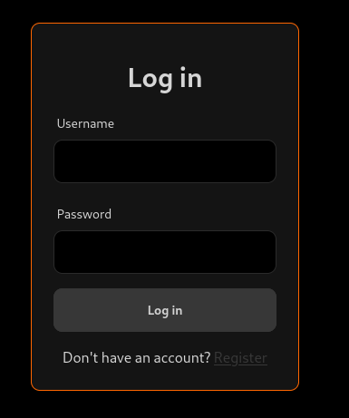
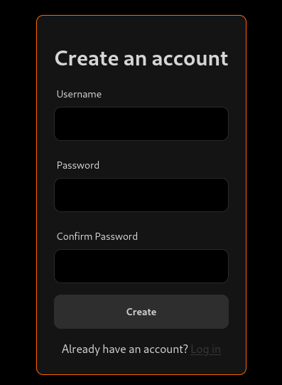

A full-stack web application with a FastAPI backend and PostgreSQL database. Features include CRUD operations, JWT authentication, role-based access control (Admin/User), and data validation using Pydantic. The frontend is built with Vanilla HTML, CSS, and JavaScript, but can easily integrate with any modern frontend framework.

how to run:

  start your posgresql database
  edit the config files for both backend and frontend to change the host and port
  run the main.py in the backend to start the fastapi server
  serve the frontend with any webserver (example apache2, python http.server etc)
  swagger UI is available in the /docs endpoint

